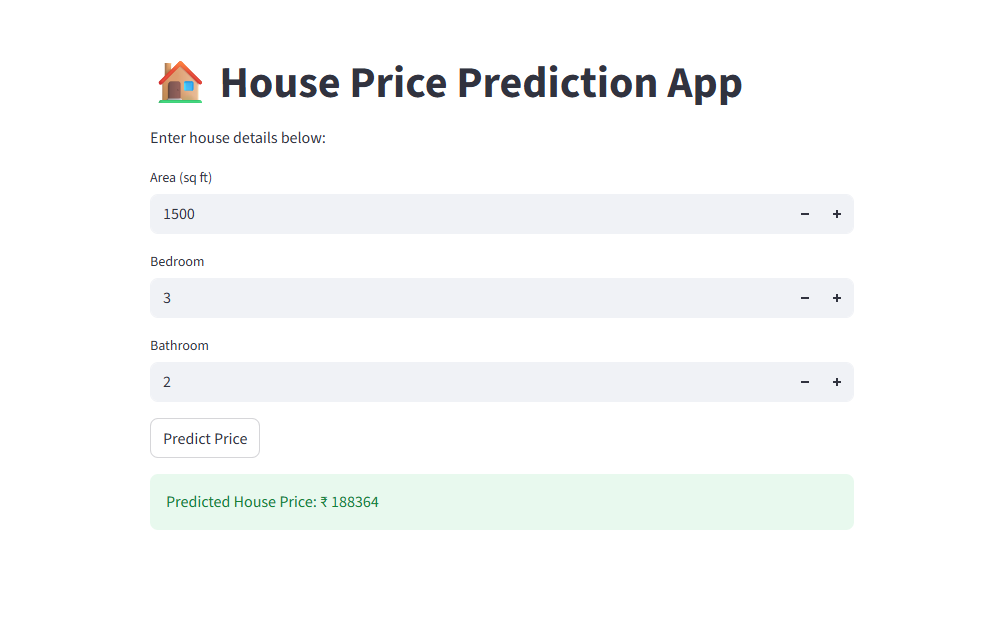

# 🏠 House Price Prediction using Machine Learning

## 📌 Project Overview

This project predicts house prices based on property features using a Machine Learning model. The application provides an interactive web interface where users can enter house details and receive an estimated house price instantly.

The project demonstrates the complete Machine Learning workflow including:

- Data preprocessing
- Exploratory Data Analysis (EDA)
- Model training
- Model evaluation
- Model deployment using Streamlit

---

## 🎯 Objective

To develop a Machine Learning model capable of predicting house prices using important housing features such as:

- Area (Square Feet)
- Number of Bedrooms
- Number of Bathrooms

---

## 📊 Dataset

The project uses a housing dataset containing various house attributes and corresponding prices.

### Features Used

| Feature | Description |
|----------|-------------|
| Area | Total area of the house (sq ft) |
| Bedrooms | Number of bedrooms |
| Bathrooms | Number of bathrooms |

### Target Variable

- House Price

---

## 🛠 Technologies Used

- Python
- Pandas
- NumPy
- Matplotlib
- Seaborn
- Scikit-Learn
- Streamlit
- Joblib

---

## 🧠 Machine Learning Model

### Algorithm Used

**Linear Regression**

Linear Regression was used to learn the relationship between house features and house prices.

---

## 🔄 Project Workflow

### 1. Data Collection
Load and inspect the housing dataset.

### 2. Data Preprocessing
- Handle missing values
- Select important features
- Prepare data for training

### 3. Exploratory Data Analysis
- Dataset visualization
- Feature relationship analysis
- Correlation analysis

### 4. Model Training
Train a Linear Regression model using Scikit-Learn.

### 5. Model Evaluation
Evaluate prediction performance using regression metrics.

### 6. Deployment
Deploy the trained model using Streamlit for real-time predictions.

---

## 🚀 Streamlit Application

The application allows users to:

✔ Enter house area

✔ Select number of bedrooms

✔ Select number of bathrooms

✔ Get predicted house price instantly

---

## 📸 Application Screenshot



---

## 📂 Project Structure

```text
PRODIGY_ML_1/
│
├── data/
│   └── Housing.csv
│
├── house_price_prediction.ipynb
├── app.py
├── model.pkl
├── House_price_detection_app.png
├── requirements.txt
└── README.md
```

---

## ⚙️ Installation

Clone the repository:

```bash
git clone https://github.com/GaikwadGayatri16/PRODIGY_ML_1.git
```

Move into project directory:

```bash
cd PRODIGY_ML_1
```

Install required packages:

```bash
pip install -r requirements.txt
```

---

## ▶️ Run the Application

```bash
streamlit run app.py
```

The application will open in your browser.

---

## 📈 Sample Prediction

Input:

- Area = 1500 sq ft
- Bedrooms = 3
- Bathrooms = 2

Output:

```text
Predicted House Price: ₹188364
```

---

## 🔮 Future Improvements

- Use advanced regression algorithms
- Add more housing features
- Improve UI design
- Deploy on Streamlit Cloud
- Real-time property valuation system

---

## 👨‍💻 Author

**Gayatri Gaikwad**

Machine Learning Intern

Prodigy InfoTech

Task-01: House Price Prediction using Machine Learning
